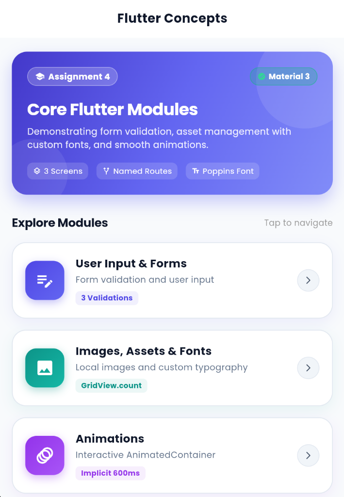
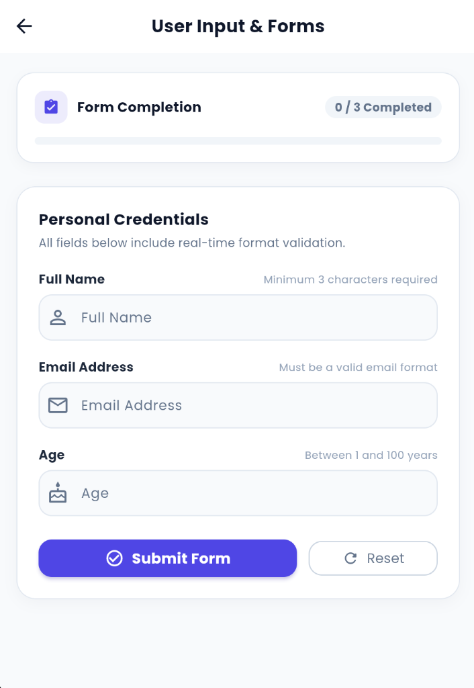
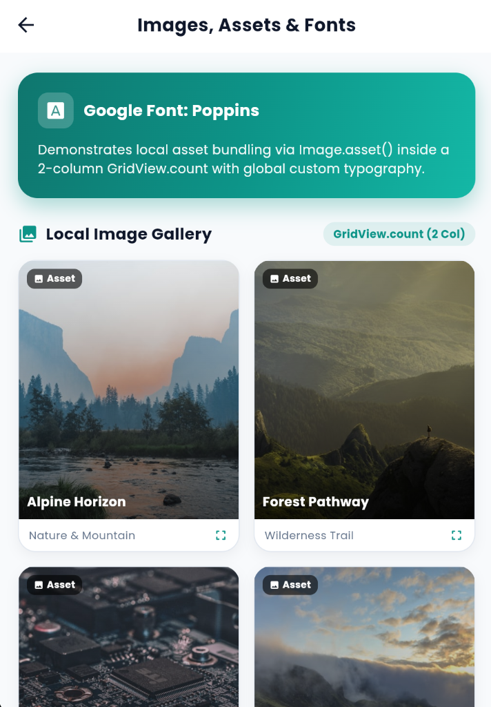
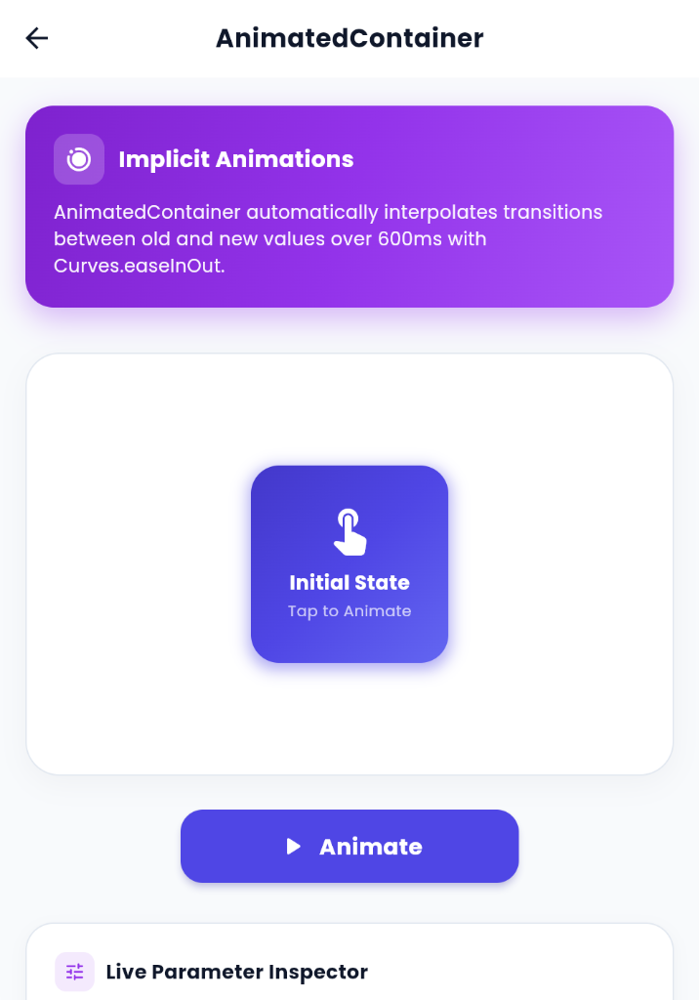

# Assignment 4: Forms, Assets, Fonts & Animations

A comprehensive, responsive Flutter application demonstrating core mobile development concepts including interactive form validation, local image asset management with `GridView.count`, custom Google Fonts typography (`Poppins`), implicit animations using `AnimatedContainer`, and structured named route navigation.

---

## 📸 Application Screenshots

| 🏠 HomeScreen (`/`) | 📝 FormScreen (`/form`) | 🖼️ ImageGridScreen (`/images`) | ✨ AnimationScreen (`/animation`) |
| :---: | :---: | :---: | :---: |
|  |  |  |  |

---

## 🎯 Objective

The objective of this assignment is to develop a modular Flutter application that demonstrates mastery over the following key Flutter concepts:

1. **User Input & Validation**: Processing and validating user information using `Form`, `GlobalKey<FormState>`, `TextFormField`, `TextEditingController`, and `InputDecoration`.
2. **Local Image Assets & Grids**: Managing and displaying local bundled assets using `Image.asset()` inside a 2-column `GridView.count`.
3. **Custom Typography**: Configuring and applying custom font families (`Poppins-Regular` & `Poppins-Bold`) via `pubspec.yaml` and global `ThemeData`.
4. **Interactive Animations**: Implementing smooth property transitions (size, color, and border radius) using `AnimatedContainer` and `setState()`.
5. **Named Route Navigation**: Managing multi-screen routing cleanly using `MaterialApp(routes: ...)` and `Navigator.pushNamed()`.

---

## 📱 Application Screens

The application is structured into **4 distinct screens**:

```text
HomeScreen (Route: '/')
│
├── 1. User Input & Forms (Route: '/form')
│       └── FormScreen
│
├── 2. Images, Assets & Fonts (Route: '/images')
│       └── ImageGridScreen
│
└── 3. Animations (Route: '/animation')
        └── AnimationScreen
```

### 1. HomeScreen (`/`)
* **AppBar Title**: `Flutter Concepts`
* Serves as the primary navigation hub.
* Features three interactive navigation cards that route to the respective screens via `Navigator.pushNamed()`:
  * **Card 1 — User Input & Forms**: `Icons.edit_note` $\rightarrow$ `/form`
  * **Card 2 — Images, Assets & Fonts**: `Icons.image` $\rightarrow$ `/images`
  * **Card 3 — Animations**: `Icons.animation` $\rightarrow$ `/animation`

### 2. FormScreen (`/form`)
* **AppBar Title**: `User Input & Forms`
* **Form Handling**:
  * Utilizes `GlobalKey<FormState>()` for validation state tracking.
  * Employs separate `TextEditingController` instances for every field with complete resource cleanup in `dispose()`.
  * Wrapped inside a `SingleChildScrollView` to prevent keyboard viewport overflows.
* **Fields & Validation Rules**:
  1. **Full Name** (`Icons.person_outline`): Required, non-empty, minimum 3 characters.
  2. **Email Address** (`Icons.email_outlined`): Required, validated using standard email regex pattern (`^[a-zA-Z0-9._%+-]+@[a-zA-Z0-9.-]+\.[a-zA-Z]{2,}$`).
  3. **Age** (`Icons.cake_outlined`): Required, numeric integer between 1 and 100.
* **Submission Feedback**:
  * Displays inline error messages if validation fails.
  * On success, shows a styled floating `SnackBar` (`Form submitted successfully!`) and displays a summary details card.

### 3. ImageGridScreen (`/images`)
* **AppBar Title**: `Images, Assets & Fonts`
* **Local Asset Display**:
  * Displays 4 bundled local images (`image1.jpg`, `image2.jpg`, `image3.jpg`, `image4.jpg`) located in `assets/images/`.
  * Utilizes `GridView.count` with 2 columns (`crossAxisCount: 2`), custom card elevation, `BoxFit.cover`, rounded borders, and asset badges.
* **Custom Typography**:
  * Applies the custom `Poppins` font across all titles, captions, and an interactive typography preview section comparing Regular (400), Medium (500), and Bold (700) weights.

### 4. AnimationScreen (`/animation`)
* **AppBar Title**: `AnimatedContainer`
* **Animation Mechanics**:
  * Features a centered `AnimatedContainer` with `duration: const Duration(milliseconds: 600)` and `curve: Curves.easeInOut`.
  * Interpolates multiple properties simultaneously based on state variable `_isExpanded`:
    * **Dimensions**: 140px $\times$ 140px $\leftrightarrow$ 260px $\times$ 240px
    * **Color**: Deep Indigo (`#3F51B5`) $\leftrightarrow$ Vibrant Deep Orange (`#FF5722`)
    * **Border Radius**: 18px $\leftrightarrow$ 50px
    * **Elevation Shadow**: 6px $\leftrightarrow$ 16px
* **Controls & State**:
  * Dynamic button toggling between `Animate` and `Reset Animation`.
  * Includes a real-time state property inspector panel detailing current dimensions, color hex, radius, and duration.

---

## 🧩 Flutter Widgets & Concepts Used

| Widget / Concept | Purpose & Implementation |
| :--- | :--- |
| **`Scaffold`** | Provides visual layout structure, app bars, and background canvases. |
| **`AppBar`** | Top navigation bar with standardized titles and centering across all screens. |
| **`Form`** | Container widget grouping form field controls for unified validation. |
| **`GlobalKey<FormState>`** | Uniquely identifies and controls the form validation state (`_formKey.currentState!.validate()`). |
| **`TextFormField`** | Specialized input field integrating validation, controllers, and decoration. |
| **`TextEditingController`** | Reads, updates, and clears text field values; disposed in `dispose()`. |
| **`validator`** | Synchronous validation callback returning error strings or `null`. |
| **`InputDecoration`** | Customizes field labels, hint text, icons, filled colors, and rounded borders. |
| **`SnackBar`** | Floating feedback message displayed via `ScaffoldMessenger.of(context).showSnackBar()`. |
| **`Image.asset`** | Loads and renders local image assets packaged within the app bundle. |
| **`GridView` / `GridView.count`** | Creates responsive 2-column scrollable grid layouts for images. |
| **`ThemeData`** | Sets global app styling, Material 3 design, color seeds, and custom `fontFamily`. |
| **`Custom Font`** | Bundles TrueType fonts (`Poppins-Regular.ttf`, `Poppins-Bold.ttf`) registered in `pubspec.yaml`. |
| **`AnimatedContainer`** | Implicitly animates container property changes over a specified duration and curve. |
| **`setState`** | Triggers widget rebuilds upon state mutations (e.g. form submission, animation toggle). |
| **`Navigator.pushNamed`** | Navigates to target routes registered in the named route table. |
| **`Named Routes`** | Centralized route map in `MaterialApp` (`'/'`, `'/form'`, `'/images'`, `'/animation'`). |

---

## 📁 Project Directory Structure

```text
assignment 4/
│
├── assets/
│   ├── fonts/
│   │   ├── Poppins-Bold.ttf          # Poppins Bold (Weight 700) font binary
│   │   └── Poppins-Regular.ttf       # Poppins Regular (Weight 400) font binary
│   │
│   └── images/
│       ├── image1.jpg                # Alpine Horizon local asset
│       ├── image2.jpg                # Forest Pathway local asset
│       ├── image3.jpg                # Tech Hardware local asset
│       └── image4.jpg                # Misty Mountain local asset
│
├── lib/
│   ├── main.dart                     # App entry point, MaterialApp, Theme & Named Routes
│   └── screens/
│       ├── home_screen.dart          # Main navigation dashboard
│       ├── form_screen.dart          # Form input validation and SnackBar demo
│       ├── image_grid_screen.dart    # GridView.count and custom typography demo
│       └── animation_screen.dart     # Interactive AnimatedContainer demo
│
├── test/
│   └── widget_test.dart              # Automated widget & navigation unit tests
│
├── pubspec.yaml                      # Project dependencies, assets & fonts config
└── README.md                         # Complete project documentation
```

---

## ⚙️ Configuration Details

### `pubspec.yaml` Asset & Font Registration

```yaml
flutter:
  uses-material-design: true

  assets:
    - assets/images/

  fonts:
    - family: Poppins
      fonts:
        - asset: assets/fonts/Poppins-Regular.ttf
        - asset: assets/fonts/Poppins-Bold.ttf
          weight: 700
```

### Named Routes in `main.dart`

```dart
MaterialApp(
  debugShowCheckedModeBanner: false,
  title: 'Flutter Concepts',
  theme: ThemeData(
    fontFamily: 'Poppins',
    useMaterial3: true,
  ),
  initialRoute: '/',
  routes: {
    '/': (context) => const HomeScreen(),
    '/form': (context) => const FormScreen(),
    '/images': (context) => const ImageGridScreen(),
    '/animation': (context) => const AnimationScreen(),
  },
);
```

---

## 🚀 How to Run the Project

### Prerequisites
* Flutter SDK (3.0.0 or later)
* Dart SDK (3.0.0 or later)
* Android Studio / VS Code / Chrome for web preview

### Running the Application

1. Open your terminal and navigate to the `assignment 4` directory:
   ```bash
   cd "assignment 4"
   ```

2. Fetch dependencies:
   ```bash
   flutter pub get
   ```

3. Run code analysis (verify zero errors):
   ```bash
   flutter analyze
   ```

4. Run widget test suite:
   ```bash
   flutter test
   ```

5. Launch the app on your preferred target (macOS Desktop, Android Emulator, iOS Simulator, or Chrome):
   ```bash
   flutter run
   ```
